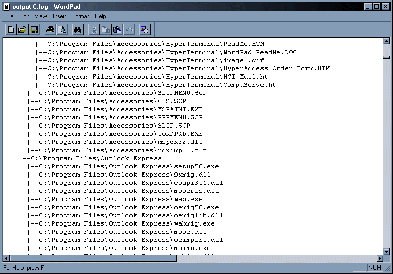



## Drive Structure

### Description

Just a simple program which uses the FileSystemObject and Recursion to output a complete directory/file structure of your computer to a file. I was originally gonna use this as a sort of snooping thing a while ago, you could run it on someones computer, and then read the text file to see what they had on their computers. The text files come out quite large, but when zipped up they're usually only about 50k. Uses a good example of recursion.
 
### More Info
 

             |
---                |---
**Submitted On**   |2001-07-22 18:25:30
**By**             |[JimCamel](https://github.com/Planet-Source-Code/PSCIndex/blob/master/ByAuthor/jimcamel.md)
**Level**          |Intermediate
**User Rating**    |4.6 (23 globes from 5 users)
**Compatibility**  |VB 6\.0
**Category**       |[Files/ File Controls/ Input/ Output](https://github.com/Planet-Source-Code/PSCIndex/blob/master/ByCategory/files-file-controls-input-output__1-3.md)
**World**          |[Visual Basic](https://github.com/Planet-Source-Code/PSCIndex/blob/master/ByWorld/visual-basic.md)
**Archive File**   |[Drive Stru232777222001\.zip](https://github.com/Planet-Source-Code/jimcamel-drive-structure__1-25336/archive/master.zip)

